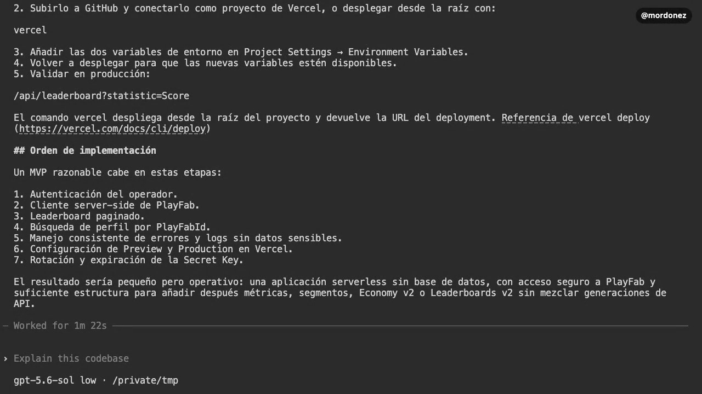

# PlayFab Context Builder

Give your AI coding agent a local, searchable copy of the official Microsoft
PlayFab documentation.

PlayFab Context Builder downloads the documentation from Microsoft Learn,
converts it to clean Markdown, and installs a `playfab-expert` skill that can
answer PlayFab questions with links to the original sources.

You do not need to know Python or PlayFab internals. The same commands work on
Windows, macOS, and Linux.

## What you get

- A local PlayFab Documentation Library stored in `~/.playfab-docs`.
- Official Guides covering PlayFab features and workflows.
- REST API References covering request fields, responses, authentication, and
  errors.
- The `playfab-expert` skill for Codex and other compatible coding agents.
- Answers grounded in the downloaded documentation instead of model memory
  alone.

The Microsoft documentation itself is not included in this repository. It is
downloaded directly from Microsoft Learn when you run the builder.

## Video walkthrough

[](https://raw.githubusercontent.com/mordonez/playfab-docs/main/docs/assets/playfab-context-builder-demo.webm)

Select the image to play the WebM recording of the complete installation and
first documented Codex answer.

The reproducible
[`shot-scraper` storyboard](docs/video/playfab-context-builder-storyboard.yml)
is included in the repository. It starts a real writable terminal with `ttyd`,
executes every displayed command, and records that browser session.

The recorded session uses a previously populated PlayFab Documentation Library
as the `--use-cache` input. The five-page command is the quick refresh shown on
screen; the subsequent Codex answer can therefore search the complete library.
On a new computer, run the complete build from step 2 before asking broad
questions.

## Before you start

You need:

1. An internet connection.
2. [`uv`](https://docs.astral.sh/uv/getting-started/installation/), which runs
   the builder without a manual Python setup.
3. [`Node.js`](https://nodejs.org/en/download), which provides `npx` for
   installing the skill.
4. A compatible coding agent such as
   [OpenAI Codex](https://developers.openai.com/codex/cli/).

### Install `uv`

On macOS or Linux, open Terminal and run:

```bash
curl -LsSf https://astral.sh/uv/install.sh | sh
```

On Windows, open PowerShell and run:

```powershell
powershell -ExecutionPolicy ByPass -c "irm https://astral.sh/uv/install.ps1 | iex"
```

Close and reopen the terminal after installation. Confirm that everything is
ready:

```bash
uvx --version
node --version
npx --version
```

## Five-minute quickstart

These commands are identical in Terminal, PowerShell, and Windows Terminal.

### 1. Prepare Crawl4AI

This one-time command installs the browser used to read Microsoft Learn:

```bash
uvx --from crawl4ai crawl4ai-setup
```

### 2. Build a small documentation library

Download five pages first to verify that the setup works:

```bash
uvx --from git+https://github.com/mordonez/playfab-docs@v0.1.0 playfab-context-builder --max-pages 5 --use-cache
```

The five-page library is only a quick test and cannot answer every PlayFab
question. Once the test succeeds, build the complete library:

```bash
uvx --from git+https://github.com/mordonez/playfab-docs@v0.1.0 playfab-context-builder --use-cache
```

Future runs reuse cached downloads and update the existing library.

### 3. Install the PlayFab Expert skill

Install the skill globally for Codex:

```bash
npx --yes skills add mordonez/playfab-docs --skill playfab-expert --agent codex --global --yes
```

To install it for every compatible agent detected on your computer:

```bash
npx --yes skills add mordonez/playfab-docs --skill playfab-expert --agent '*' --global --yes
```

### 4. Ask Codex a PlayFab question

Start Codex with a question that explicitly selects the skill:

```bash
codex 'Usa $playfab-expert para explicar cómo construir un MVP de dashboard que consuma PlayFab y se despliegue en Vercel.'
```

On Windows PowerShell, the same single-quoted command prevents PowerShell from
interpreting `$playfab-expert` as a variable.

The skill searches the local library, reads the most relevant documents, and
includes links to the corresponding Microsoft Learn pages in its answer.

## Check that the installation works

Run the built-in diagnostic:

```bash
uvx --from git+https://github.com/mordonez/playfab-docs@v0.1.0 playfab-context-builder-doctor
```

It reports:

- whether the documentation library exists;
- when it was last updated;
- how many documents are indexed;
- whether the skill is installed; and
- whether an interrupted build left temporary files behind.

If the documentation is older than seven days, refresh it:

```bash
uvx --from git+https://github.com/mordonez/playfab-docs@v0.1.0 playfab-context-builder --use-cache
```

## Common commands

Build only Official Guides:

```bash
uvx --from git+https://github.com/mordonez/playfab-docs@v0.1.0 playfab-context-builder --source-type official-guide
```

Build only the Admin REST API Reference:

```bash
uvx --from git+https://github.com/mordonez/playfab-docs@v0.1.0 playfab-context-builder --source-type rest-api --surface admin
```

Build only a product area such as Multiplayer:

```bash
uvx --from git+https://github.com/mordonez/playfab-docs@v0.1.0 playfab-context-builder --area multiplayer
```

Use fewer concurrent browser requests on a slow connection:

```bash
uvx --from git+https://github.com/mordonez/playfab-docs@v0.1.0 playfab-context-builder --concurrency 1
```

Store the library somewhere else:

On macOS or Linux:

```bash
export PLAYFAB_DOCS_DIR="$PWD/.playfab-docs"
uvx --from git+https://github.com/mordonez/playfab-docs@v0.1.0 playfab-context-builder --use-cache
```

On Windows PowerShell:

```powershell
$env:PLAYFAB_DOCS_DIR="$PWD\.playfab-docs"
uvx --from git+https://github.com/mordonez/playfab-docs@v0.1.0 playfab-context-builder --use-cache
```

The agent must receive the same `PLAYFAB_DOCS_DIR` environment variable when
you use a custom location.

## Where files are stored

By default, the builder creates:

```text
~/.playfab-docs/
├── raw/
│   ├── official-guide/
│   ├── rest-api/
│   └── _retired/
└── reports/
    ├── search_index.jsonl
    ├── anomalies.jsonl
    ├── coverage_gaps.jsonl
    ├── external_references.jsonl
    ├── manifest_changes.jsonl
    ├── fetch_failures.jsonl
    └── summary.json
```

The builder publishes updates atomically: an interrupted or failed refresh
does not overwrite a previously valid document. Pages removed from Microsoft
Learn navigation are preserved under `_retired` but excluded from normal
search.

## Troubleshooting

### `uvx` is not recognized

Close and reopen the terminal after installing `uv`. If the problem continues,
follow the PATH instructions printed by the `uv` installer.

### `npx` is not recognized

Install the current Node.js LTS release and reopen the terminal.

### The browser setup fails

Run the setup command again from a terminal with administrator permissions:

```bash
uvx --from crawl4ai crawl4ai-setup
```

On Linux, Crawl4AI may report missing operating-system browser libraries.
Install the packages named in its error output and rerun the command.

### The agent says the library is missing or stale

Build or refresh it and then run the diagnostic:

```bash
uvx --from git+https://github.com/mordonez/playfab-docs@v0.1.0 playfab-context-builder --use-cache
uvx --from git+https://github.com/mordonez/playfab-docs@v0.1.0 playfab-context-builder-doctor
```

### A five-page test cannot answer my question

That is expected. Remove `--max-pages 5` and build the complete library.

## Documentation sources

The library discovers content through Microsoft Learn's official navigation
manifests and currently covers:

- Official Guides under
  [`learn.microsoft.com/en-us/xbox/playfab/`](https://learn.microsoft.com/en-us/xbox/playfab/).
- REST API References under
  [`learn.microsoft.com/en-us/rest/api/playfab/`](https://learn.microsoft.com/en-us/rest/api/playfab/?view=playfab-rest).

English (`en-us`) pages are treated as canonical. Authenticated pages,
community content, external repositories, and localized duplicates are outside
the current scope.

## Development

Contributions are welcome. Clone the repository and run:

```bash
uv sync --dev
uv run ruff check .
uv run pytest
uv build
```

The normal test suite does not access the internet. The optional live smoke
test requires the Crawl4AI browser and network access:

```bash
PLAYFAB_RUN_LIVE_TESTS=1 uv run pytest -m live
```

On Windows PowerShell:

```powershell
$env:PLAYFAB_RUN_LIVE_TESTS="1"
uv run pytest -m live
```

## License

The builder and skill are available under the MIT License. Downloaded Microsoft
Learn content remains subject to Microsoft's terms.
